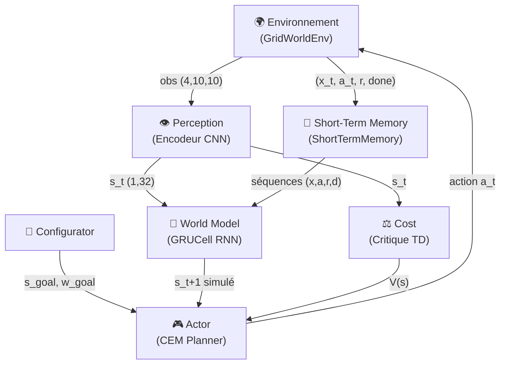

# 🏗️ Architecture : Les 6 Modules Cognitifs de LeCun

> Ce document décrit la théorie mathématique et conceptuelle derrière l'implémentation, en se basant sur le papier [*A Path Towards Autonomous Machine Intelligence*](https://openreview.net/pdf?id=BZ5a1r-kVsf) (Yann LeCun, 2022).

---

## Vue d'Ensemble

L'architecture repose sur **6 modules cognitifs** qui interagissent pour permettre à l'agent de percevoir, simuler, planifier et agir dans un environnement inconnu. Contrairement au Reinforcement Learning classique (essai-erreur pur), cet agent **raisonne** avant d'agir en simulant les conséquences de ses actions dans un modèle interne du monde.



---

## Les 6 Modules en Détail

### 1. Le Configurator (`modules/configurator.py`)

**Rôle :** Le "chef d'orchestre" qui décide de l'objectif courant de l'agent en fonction de son état interne.

La classe `Configurator` maintient deux vecteurs latents cibles (`s_target` et `s_station`) définis par `set_goals(s_target, s_station)`. Sa méthode `get_configuration(energy)` retourne dynamiquement :

| Paramètre | Énergie > 30 | Énergie ≤ 30 |
|---|---|---|
| `s_goal` | `s_target` (la cible) | `s_station` (la recharge) |
| `w_energy` | 0.1 (faible) | 5.0 (prioritaire) |
| `w_goal` | 1.0 | 2.0 (urgence accrue) |

Quand l'énergie chute sous 30, le Configurator redirige automatiquement l'agent vers la station de recharge.

---

### 2. La Perception (`modules/perception.py`)

**Rôle :** Compresser l'observation brute de la grille (un tenseur `(4, 10, 10)` avec 4 canaux : obstacles, cible, station, agent) en un vecteur latent dense `s_t` de dimension 32.

**Architecture :** Un petit ResNet composé de :
- `Conv2d(4, 32, 3x3)` → 2× `ResidualBlock(32)` → `Conv2d(32, 64, 3x3, stride=2)` → 2× `ResidualBlock(64)` → `Flatten` → `Linear(64*5*5, 128)` → `Linear(128, 32)`

**Point clé :** La couche `Conv2d(..., stride=2)` effectue un *downsampling* spatial de 10×10 à 5×5. La sortie finale est un vecteur de `latent_dim=32` dimensions.

> **Pas de `BatchNorm` finale** car le régulariseur `SIGReg` (cf. section suivante) s'occupe de maintenir la distribution de l'espace latent.

---

### 3. Le World Model (`modules/world_model.py`)

**Rôle :** Prédire l'état futur `s_{t+1}` à partir de l'état courant `s_t`, d'une action `a_t` et d'une mémoire temporelle `h_t`. C'est le "simulateur interne" de l'agent.

**Architecture :**

```
(s_t, a_t) ──→ input_proj [Linear(36, 128) + ReLU] ──→ GRUCell(128, 128) ──→ predictor [128→128→128→32] ──→ δ
                                                           ↑                                                  │
                                                           h_t                                          s_{t+1} = s_t + δ
```

**Deux modes d'utilisation :**

| Méthode | Signature | Usage |
|---|---|---|
| `forward_step(s_t, a_t, h_t)` | `→ (s_next, h_next)` | Inférence / Planification CEM (1 pas) |
| `forward_seq(s_0, a_seq, h_0)` | `→ (s_preds, h_seq)` | Entraînement BPTT (séquence complète) |

**Prédiction résiduelle :** Le réseau prédit un `delta` (Δ) qu'il ajoute à `s_t` pour obtenir `s_{t+1} = s_t + δ`. Cela facilite considérablement l'apprentissage car le réseau n'a qu'à modéliser les *changements* et non les états absolus.

---

### 4. Le Cost / Critique (`modules/cost.py`)

**Rôle :** Estimer le **coût futur attendu** d'un état `s_t`. Plus la sortie `V(s_t)` est faible, meilleur est l'état.

**Architecture :** Un MLP simple : `Linear(32, 32) → ReLU → Linear(32, 1)`

**Méthode :** `forward(s_t) → V(s_t)` (scalaire)

Le Critique est entraîné par **TD-Learning** (Temporal Difference) :
$$V(s_t) \leftarrow r_t + \gamma \cdot V(s_{t+1})$$

Dans la version N-Step (script `train_critic_only.py`), l'équation de Bellman est étendue :
$$V(s_t) = -r_t + \gamma(-r_{t+1}) + \gamma^2(-r_{t+2}) + \gamma^3 \cdot V_{target}(s_{t+3})$$

> Le signe est inversé (`-r`) car le planificateur CEM **minimise** le coût. Les récompenses positives (atteindre la cible = +100) deviennent des coûts négatifs (-100), et les pénalités (collision = -5) deviennent des coûts positifs (+5).

---

### 5. L'Actor / Planificateur (`modules/actor.py`)

**Rôle :** Choisir la meilleure action à exécuter en simulant des trajectoires futures dans le World Model. C'est le raisonnement **Système-2** (délibératif, lent mais intelligent).

**Algorithme : Cross-Entropy Method (CEM)**

```
Pour M itérations CEM :
  1. Échantillonner N séquences d'actions de longueur H
     selon une distribution catégorielle action_probs (H, 4)

  2. Rollout : Simuler chaque séquence dans le World Model
     s_sim, h_sim = world_model.forward_step(s_sim, a_onehot, h_sim)

  3. Évaluer le coût de l'état final simulé :
     total_cost = w_goal × MSE(s_sim, s_goal) + cost_module(s_sim)
              ↑ Boussole (distance brute)        ↑ Critique (valeur long terme)

  4. Sélectionner les K meilleures séquences ("élites")
     top_costs, top_indices = torch.topk(total_cost, K, largest=False)

  5. Mettre à jour action_probs avec lissage de Laplace :
     counts = bincount(elite_actions) 
     new_probs = (counts + 0.1) / (K + 0.1 × action_dim)
```

**Méthode :** `plan(s_t, h_t, world_model, cost_module, s_goal, w_goal) → (action, sequence, cost)`

**La combinaison Boussole + Critique** est cruciale :
- La **Boussole** (`dist_to_goal`) attire l'agent vers la cible en ligne droite.
- Le **Critique** (`c_critic`) pénalise les états dangereux (murs, impasses).
- Sans le Critique, l'agent fonce dans les pièges en U car s'éloigner de la cible augmente la distance.

---

### 6. La Short-Term Memory (`modules/memory.py`)

**Rôle :** Stocker les expériences vécues par l'agent dans un buffer circulaire pour les rejouer lors de l'entraînement.

**Classe :** `ShortTermMemory(capacity=10000)`

| Méthode | Signature | Description |
|---|---|---|
| `push(x_t, a_t, x_next, reward, done)` | Stocke une transition | Ajout au buffer circulaire |
| `sample_transitions(batch_size)` | `→ (x, a, x_next, r, d)` | Échantillonnage de transitions individuelles |
| `sample_sequences(batch_size, seq_len)` | `→ (x_0, a_seq, x_next_seq, r_seq, d_seq)` | Extraction de séquences temporelles contiguës (pour BPTT et N-Step TD) |

La méthode `sample_sequences` vérifie que les séquences extraites ne traversent pas une frontière d'épisode (`done=True`) ni le curseur de wrap du buffer circulaire.

---

## Prévention du Latent Collapse : SIGReg

### Le problème

Dans une architecture JEPA (sans décodeur), l'encodeur est tenté de tout projeter vers un seul point (effondrement dimensionnel). L'ancienne approche utilisait un *Target Encoder* mis à jour par Exponential Moving Average (EMA) pour stabiliser les cibles.

### La solution : SIGReg (`modules/sigreg.py`)

Le **Sketch Isotropic Gaussian Regularizer** est une perte mathématique qui force la distribution des vecteurs latents à rester proche d'une gaussienne isotrope $\mathcal{N}(0, I)$.

**Fonctionnement :**
1. Projeter les vecteurs latents sur `num_proj=1024` directions aléatoires.
2. Calculer la fonction caractéristique empirique de chaque projection.
3. Comparer à la fonction caractéristique d'une gaussienne standard via la statistique d'Epps-Pulley.
4. Minimiser l'écart → les dimensions restent décorrélées et actives.

**Résultat vérifié :** Le diagnostic montre **32/32 dimensions actives** (variance > 0.01), preuve que SIGReg empêche efficacement le collapse.

---

## La Planification Système-2

L'architecture implémente le concept de **Model Predictive Control (MPC)** :

1. L'agent perçoit l'environnement via la `Perception` → `s_t`
2. Le `Configurator` détermine l'objectif (`s_goal`) selon l'énergie restante
3. L'`Actor` (CEM) simule N×H actions dans le `WorldModel`
4. Le `Cost` évalue la qualité de l'état final imaginé
5. L'agent exécute uniquement la **première action** de la meilleure séquence
6. On recommence au pas suivant (horizon glissant)

C'est exactement le raisonnement "Système-2" de Daniel Kahneman : **réfléchir avant d'agir**, par opposition au réflexe instantané du Système-1 (réseaux policy-gradient classiques).
