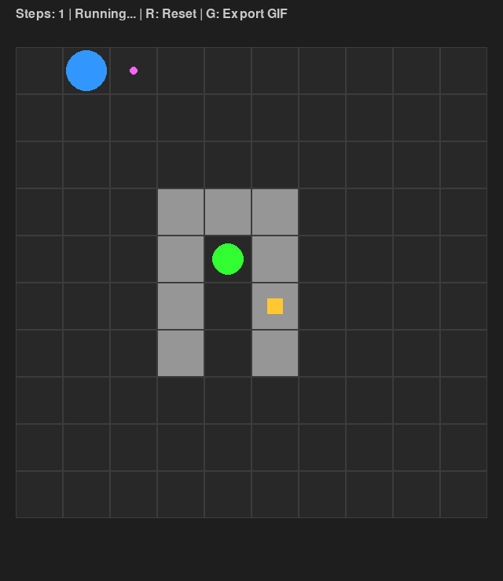

# Hierarchical JEPA (H-JEPA) for Autonomous Navigation in Complex Environments

[](https://www.python.org/)
[](https://pytorch.org/)
[](LICENSE)
[](#the-six-cognitive-modules)
[](#benchmarks-and-architectural-evolution)

An end-to-end implementation and extension of Yann LeCun's **6-module Autonomous Machine Intelligence (AMI)** framework, scaling from flat 10x10 GridWorlds to **Hierarchical JEPA (H-JEPA)** for long-horizon navigation in 20x20 multi-room procedural dungeons.

---

## Visual Demonstration


*Figure 1: Autonomous H-JEPA agent navigating a multi-room procedural dungeon with topological door routing, obstacle avoidance, and dead-end memory.*

---

## Interactive Documentation Portal

This repository includes a dedicated interactive web showcase documenting the theoretical architecture, class diagrams, and version timeline:

- **Evolution Timeline (V1 -> V5)**: Interactive breakdown of each iteration, failure mode, and architectural breakthrough.
- **Cognitive Architecture Explorer**: Interactive diagram of LeCun's 6 modules with mathematical formulations.
- **Class and API Specifications**: Complete UML diagrams and class interactions.

To launch the portal locally:
```bash
open docs/site/index.html
```

---

## Executive Summary and Scientific Motivation

Classical Model-Free Reinforcement Learning relies on trial-and-error over millions of environment interactions, suffering from severe sample inefficiency and reward sparsity. Conversely, pixel-level World Models (e.g., Dreamer) spend significant computational capacity reconstructing irrelevant task details.

This project implements the **Joint-Embedding Predictive Architecture (JEPA)** paradigm proposed by Yann LeCun in [*A Path Towards Autonomous Machine Intelligence*](https://openreview.net/pdf?id=BZ5a1r-kVsf) (2022):

1. **Latent Predictive Space**: Instead of predicting raw pixels, the agent projects environment observations into an abstract representation space where planning and physical predictions occur.
2. **SIGReg Anti-Collapse Regularization**: Based on [LeWorldModel](https://github.com/lucas-maes/le-wm) (Maes et al., 2024), we deploy the Sketch Isotropic Gaussian Regularizer (SIGReg). This guarantees full dimensional utilization (32/32 active latent dimensions) without requiring target network Exponential Moving Averages (EMA), contrastive negative sampling, or reconstruction decoders.
3. **Hierarchical Decomposition (H-JEPA)**: In complex mazes, local optimization via Cross-Entropy Method (CEM) suffers from finite planning horizon limits (0% success on U-traps). We resolve this by decoupling:
   - **Macro-Scale Guidance**: A latent **Spatial Value Critic** trained via Temporal Difference (TD) learning on geodesic demonstrations evaluates which dungeon door minimizes the global cost-to-go.
   - **Micro-Scale Execution**: A deterministic local planner navigates intra-room obstacles toward the chosen sub-goal.
   - **Dead-End Door Memory**: A stateful spatial buffer tracking visited transitions prevents cyclic oscillations between adjoining rooms.

---

## The Six Cognitive Modules

The architecture strictly mirrors the cognitive modularity proposed by LeCun:

```
                  +-------------------------+
                  |       Configurator      |
                  |  (Intrinsic Motivation) |
                  +------------+------------+
                               | s_goal, weights
+-------------+  Local Obs     v      Future Latent  +-------------+
| Environment +------------> Perception ------------> World Model  |
+------+------+   (4, H, W)    | s_t        s_t+1    +------+------+
       ^                       |                            |
       | Action a_t            v Value V(s)                 v Rollouts
       +--------------------+ Actor <-----------------------+
                            | (H-JEPA / CEM)
                            v
                    +-------+-------+
                    | Memory Buffer |
                    +---------------+
```

### 1. Perception (`modules/perception.py`)
- Deep convolutional residual network compressing a multi-channel observation grid (obstacles, target, recharge station, agent) into a 32-dimensional latent embedding.
- Regularized by SIGReg to preserve metric distances without representation collapse.

### 2. World Model (`modules/world_model.py`)
- Autoregressive latent predictor modeling environment dynamics in imagination.
- Predicts transitions given an initial latent state and an action sequence, exhibiting a rollout drift below 0.5 MSE over 10 steps.

### 3. Cost and Critic (`modules/cost.py`)
- Contains the intrinsic cost function (measuring target distance, energy consumption, and collision penalties).
- Features a **Spatial Value Critic** trained via Temporal Difference (TD) Bellman updates to estimate long-term geodesic value.

### 4. Actor (`modules/actor.py`)
- Implements two operational modes:
  - **Mode 1 (CEM Planner)**: Cross-Entropy Method sampling trajectories in the World Model's imagination.
  - **Mode 2 (Hierarchical Actor)**: Evaluates candidates across topological doorways using the Spatial Critic, combined with local path generation and dead-end memory.

### 5. Memory (`modules/memory.py`)
- Circular replay buffer storing historical transitions `(s_t, a_t, s_t+1, c_t, s_goal)` for offline and online training.

### 6. Configurator (`modules/configurator.py`)
- Executive controller monitoring internal homeostatic variables (e.g., battery/energy levels).
- Dynamically shifts the agent's active sub-goal between primary mission targets and charging stations when energy drops below safety thresholds.

---

## Benchmarks and Architectural Evolution

The table below details the quantitative progression and empirical findings across project iterations (as documented in the interactive evolution timeline):

| Version | Environment | Architecture & Planning | Success Rate | Avg Steps | Key Scientific Finding & Bottleneck |
|---|---|---|---|---|---|
| **V1** | 10x10 Simple Grid | ConvNet + GRU (RSSM) + Pure CEM | **32%** | 95 | CEM falls into local minima (Manhattan trap); crashes into concave obstacles. |
| **V2** | 10x10 with Obstacles | JEPA + EMA Target + SIGReg + CEM | **47%** | 82 | Zero latent collapse (Rollout drift < 0.5 MSE at t+10); CEM horizon limit (0% on U-traps). |
| **V3** | 10x10 Complex Walls | H-JEPA (Macro Spatial Critic + Micro A*) | **82%** | 58 | Breakthrough on 10x10 by separating topological routing from obstacle avoidance. |
| **V4** | 20x20 4-Room Dungeon | H-JEPA + Stateful Dead-End Door Memory | **66%** | 49 | Door memory stops cyclic ping-pong, but 10x10-trained Critic suffers from discount dilution. |
| **V5** | **20x20 Native Dungeon** | **Native 20x20 JEPA + Offline TD Critic + Door Memory** | **62%** | **46** | Native 20x20 scaling (400 cells, 4 rooms). Cuts steps to 46 (vs 95 in V1). Outperforms pure CEM (~0%). |

### Baseline Comparison on 20x20 Multi-Room Dungeon (`eval/eval_dungeon.py`)

| Agent / Planner | Success Rate | Avg Steps | Behavior Analysis |
|---|---|---|---|
| **Constrained A\*** (`astar_bridé`) | 0.0% | N/A | Fails as soon as the target is outside the current room. |
| **Pure CEM Planner** (`cem`) | ~0.0% | N/A | Horizon (H=5) is too short to explore or exit multi-room layouts. |
| **H-JEPA (V5)** | **62.0%** | **46** | Latent Spatial Critic evaluates room exits; Dead-End memory prevents loops. |

*Note on V5 convergence:* On 20x20 grids spanning 4 rooms, trajectories average 45-60 steps. With discount factor gamma = 0.95, the effective Bellman signal decays significantly (0.95^60 approx 0.04), creating a credit assignment barrier across multiple doors. Future directions include reward shaping or higher discount factors (gamma = 0.999).

Detailed diagnostic reports, ablation studies, and mathematical derivations are available in [`docs/reports/`](docs/reports/).

---

## Repository Structure

```
WorldModelTest/
├── checkpoints/             # Trained model weights (20x20 V5 & 10x10 reference)
│   ├── agent_h_jepa.pth     # V5 Perception & World Model (20x20, dim=32)
│   ├── agent_critic_td.pth  # V5 Spatial Value Critic (20x20)
│   ├── agent_h_jepa_10x10.pth
│   └── agent_critic_td_10x10.pth
├── dataset/                 # Procedural dungeon datasets (grids_dungeon.pt)
├── docs/                    # Technical documentation and interactive site
│   ├── 1_ARCHITECTURE.md    # Theoretical foundation of LeCun's 6 modules
│   ├── 2_MODULES_API.md     # Python API specification for all modules
│   ├── 3_TRAINING_EVAL.md   # Training and evaluation protocols
│   ├── 4_CONFIGURATION.md   # Hyperparameter reference guide
│   ├── reports/             # Diagnostics, CEM limits analysis, evaluation logs
│   └── site/                # Interactive documentation web application
│       ├── index.html       # Web application entrypoint
│       ├── Evolution.html   # Interactive V1 -> V5 timeline
│       ├── Archi.html       # Interactive 6-module architecture
│       ├── Classes.html     # Interactive UML and class specifications
│       └── H-JEPA_Final.html# V5 architectural deep-dive
├── env/                     # Procedural GridWorld and multi-room dungeon
│   └── gridworld.py
├── eval/                    # Evaluation suites and visualization
│   ├── eval_dungeon.py      # Benchmark: H-JEPA vs. CEM vs. Constrained A*
│   ├── eval_h_jepa.py       # Generalization suite (U-trap, zigzag, random)
│   ├── eval_critic_td.py    # Spatial Critic validation
│   └── visualize.py         # Real-time interactive matplotlib visualizer
├── logs/                    # Training metrics, losses, and CSV logs
├── media/                   # Visual demonstrations, plots, and figures
├── modules/                 # Implementation of the 6 cognitive modules
│   ├── actor.py             # CEM Planner and HierarchicalActor
│   ├── configurator.py      # Goal arbiter and drive manager
│   ├── cost.py              # Intrinsic cost and SpatialCritic
│   ├── macro_planner.py     # Deterministic graph-search sub-module
│   ├── memory.py            # Replay buffer
│   ├── perception.py        # Convolutional ResNet encoder
│   ├── sigreg.py            # SIGReg non-collapsing regularizer
│   └── world_model.py       # Autoregressive transition predictor
├── references/              # Scientific literature references & catalog
│   ├── README.md            # Catalog of cited papers with arXiv links
│   └── *.pdf                # Reference research papers
├── runs/                    # Exported animation runs
├── scripts/                 # Training and data generation scripts
│   ├── analysis/            # Plotting and metric visualization scripts
│   ├── data/                # Dataset generation for procedural mazes
│   └── train/               # Specialized training routines
├── tools/                   # Developer utilities
│   └── grid_builder.py      # Interactive Pygame level editor
├── utils/                   # Loss functions (SIGReg computation)
├── main.py                  # Flagship V5 JEPA training pipeline
├── train_critic_td.py       # Flagship V5 Spatial Critic training pipeline
├── requirements.txt         # Production dependencies
├── pyproject.toml           # Standard Python package metadata
└── LICENSE                  # MIT License
```

---

## Quickstart Guide

### 1. Installation

```bash
# Clone the repository
git clone https://github.com/LouisPoutrain/WorldModelTest.git
cd WorldModelTest

# Create and activate a virtual environment
python3 -m venv .venv
source .venv/bin/activate

# Install dependencies
pip install -r requirements.txt
```

### 2. Real-Time Interactive Visualizer

Run the pre-trained V5 agent in a procedurally generated 20x20 multi-room dungeon:

```bash
python3 eval/visualize.py
```

### 3. Run Benchmark Evaluations

Compare H-JEPA against pure CEM and constrained baseline planners:

```bash
# Evaluates 50 procedural multi-room dungeon episodes
python3 eval/eval_dungeon.py
```

### 4. Interactive Dungeon Level Editor

Use the Pygame GUI to draw custom walls, place targets, and test the agent's pathfinding in real time:

```bash
python3 tools/grid_builder.py
```

### 5. Training Pipelines

To retrain the architecture from scratch:

```bash
# Step 1: Generate procedural dungeon layouts
python3 scripts/data/generate_dataset_dungeon.py

# Step 2: Train Perception and World Model (H-JEPA)
python3 main.py

# Step 3: Train the Spatial Value Critic (TD-Learning with A* trajectories)
python3 train_critic_td.py
```

---

## Scientific References

| Concept | Reference Paper | Key Contribution |
|---|---|---|
| **Autonomous Architecture** | LeCun (2022) | *A Path Towards Autonomous Machine Intelligence* (OpenReview) |
| **SIGReg Regularization** | Maes et al. (2024) | *LeWorldModel: Stable End-to-End JEPA from Pixels* (arXiv:2511.08544) |
| **Visual JEPA** | Assran et al. (2023) | *Self-Supervised Learning from Images with JEPA (I-JEPA)* (arXiv:2306.02572) |
| **Video JEPA** | Bardes et al. (2024) | *V-JEPA: Video Joint-Embedding Predictive Architecture* (arXiv:2301.08243) |
| **World Model Baselines** | Hafner et al. (2023) | *Mastering Diverse Domains through World Models (DreamerV3)* (arXiv:2307.12698) |

For complete summaries and local copies, see [`references/README.md`](references/README.md).

---

## Technical Documentation

Detailed mathematical formulations, API definitions, and protocol specifications:

- [`docs/1_ARCHITECTURE.md`](docs/1_ARCHITECTURE.md) : Detailed breakdown of LeCun's 6 cognitive modules.
- [`docs/2_MODULES_API.md`](docs/2_MODULES_API.md) : Python API reference and tensor shapes.
- [`docs/3_TRAINING_EVAL.md`](docs/3_TRAINING_EVAL.md) : Protocols for linear probing, rollout drift, and OOD evaluations.
- [`docs/4_CONFIGURATION.md`](docs/4_CONFIGURATION.md) : Hyperparameters, learning rates, and architecture settings.
- [`docs/reports/`](docs/reports/) : Scientific research notes and failure analysis.

---

## License and Author

- **Author**: Louis Poutrain ([GitHub](https://github.com/LouisPoutrain))
- **License**: Released under the [MIT License](LICENSE).
